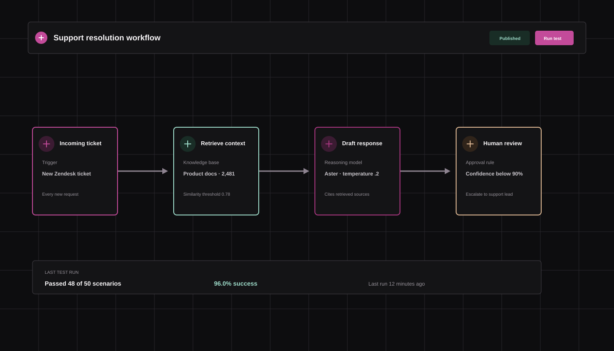
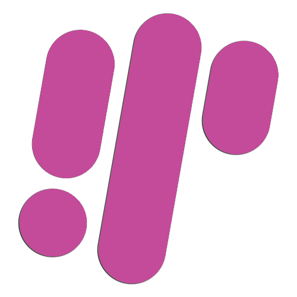

# Auralis AI Startup Template

<p align="center">
  <a href="https://wopixel.github.io/Auralis-AI-Startup-Template---by-WoPixel/" target="_blank">
    
  </a>
</p>


## Overview

Auralis is a responsive HTML5 AI startup template for product-led companies, AI platforms, developer tools, and intelligent workflow products. It is built as a static template with a serious editorial interface, a light and dark theme, Tabler Icons, a Three.js hero scene, GSAP animations, Swiper JS, Lenis smooth scrolling, responsive navigation, working tabs, product dashboard controls, forms, pricing controls, filters, accordions, and theme-aware product visuals.

The template is designed and distributed by [WoPixel](https://wopixel.com/).

## Pages

The package includes ten complete pages:

| File | Purpose |
| --- | --- |
| `index.html` | Homepage with Three.js hero, product dashboard, feature grid, workflow, integrations, and CTA. |
| `features.html` | Product capabilities with interactive workflow, evaluation, knowledge, and governance tabs. |
| `solutions.html` | Team-specific solution tabs for support, operations, product, and research. |
| `pricing.html` | Pricing cards, monthly/yearly switcher, comparison table, and FAQ accordion. |
| `customers.html` | Customer stories, outcomes, principles, and customer proof points. |
| `about.html` | Company point of view, values, timeline, and team section. |
| `blog.html` | Journal cards with category filters, search, and article modal behavior. |
| `contact.html` | Contact layout, inquiry form, location panel, and form feedback state. |
| `signup.html` | Account creation screen with validation feedback. |
| `login.html` | Login screen with validation feedback and account links. |

The main product and company pages share the same header, responsive navigation, footer, theme control, favicon, Tabler icon system, font stack, and WoPixel credit link. The signup and login pages use a focused authentication shell while retaining the same visual system and favicon.

## Requirements

- A modern browser with ES modules, CSS custom properties, and WebGL support.
- Node.js 18 or newer for the build script.
- npm.
- A local static server for development. The pages can also be opened directly, but a server is recommended for the Three.js module and browser security rules.

This is a static HTML template. It does not require PHP, Laravel, a database, or `php artisan migrate`.

## Quick Start

Install dependencies:

```bash
npm install
```

Build the browser-ready assets:

```bash
npm run build
```

Start a local server with any static server. For example:

```bash
npx serve .
```

Then open the URL printed by the server and visit `index.html`.

The build command bundles `assets/js/hero-scene.src.js` into `assets/js/hero-scene.js` and `assets/js/motion.src.js` into `assets/js/motion.js`. Edit the source files, then run the build again whenever the Three.js scene or motion system changes.

## Project Structure

```text
AI Startup Template/
|-- index.html
|-- features.html
|-- solutions.html
|-- pricing.html
|-- customers.html
|-- about.html
|-- blog.html
|-- contact.html
|-- signup.html
|-- login.html
|-- assets/
|   |-- css/
|   |   |-- styles.css
|   |   `-- premium.css
|   |-- img/
|   |-- js/
|   |   |-- config.js
|   |   |-- main.js
|   |   |-- hero-scene.src.js
|   |   |-- hero-scene.js
|   |   |-- motion.src.js
|   |   `-- motion.js
|   `-- vendor/
|       `-- tabler/
|-- scripts/
|   `-- build.mjs
|-- package.json
|-- package-lock.json
|-- README.md
`-- DOCUMENTATION.md
```

## Motion Stack

The template uses three focused motion libraries through `assets/js/motion.src.js`:

- GSAP handles the page entrance choreography, hero copy timing, scroll-triggered card reveals, and product section entrances. The code uses `ScrollTrigger` and avoids running when `prefers-reduced-motion` is enabled.
- Swiper powers the homepage trusted-team logo strip. It behaves as a touch and keyboard carousel on mobile and settles into a five-logo desktop row.
- Lenis provides smooth wheel scrolling and is synchronized with GSAP ScrollTrigger. It is disabled for reduced-motion users.

Run `npm run build` after changing `motion.src.js`. The build creates `assets/js/motion.js` and keeps the HTML pages loading the compiled browser asset rather than importing npm modules directly.

## Styling System

The stylesheet is split into two layers:

- `assets/css/styles.css` contains the base layout, semantic components, responsive rules, theme variables, forms, navigation, and reusable utility classes.
- `assets/css/premium.css` contains the visual refinement layer: tighter typography, product-stage styling, snapshot treatments, cards, controls, hero polish, motion, and brand-specific details.

The primary brand color is:

```css
--primary: #c34b9a;
```

The visual system also uses ink, muted text, paper, surface, line, and shadow variables. Use variables instead of hard-coded colors when extending a component. This keeps light and dark mode synchronized.

### Theme switching

The page starts in the preferred system theme unless a visitor has selected a theme before. The theme toggle writes the preference to local storage and updates the document attribute:

```html
<html data-theme="dark">
```

Theme variables are defined in `assets/css/styles.css`. To add a new theme-aware color, define it in both the default and dark theme blocks, then reference the variable in components.

Snapshot images support theme-specific sources with these attributes:

```html

```

`assets/js/main.js` swaps the source whenever the theme changes.

## Typography

The template uses two type families:

- Manrope for interface and display text.
- DM Mono for compact labels, metadata, chart labels, and technical UI details.

The HTML pages load the Google Fonts versions for easy preview. The npm package also includes `@fontsource-variable/manrope` and `@fontsource/dm-mono` for projects that need self-hosted fonts. To make the template fully offline, replace the Google Fonts links with local `@font-face` declarations and point them to the installed font files.

Keep headings restrained in product panels and dashboards. The large display scale is reserved for the home hero and page heroes.

## Tabler Icons

All interface icons use the Tabler Icons webfont. The HTML includes the Tabler stylesheet and uses the standard class format:

```html
<i class="ti ti-brain" aria-hidden="true"></i>
```

Examples used by the template include:

```html
<i class="ti ti-route"></i>
<i class="ti ti-chart-dots-3"></i>
<i class="ti ti-shield-check"></i>
<i class="ti ti-brand-linkedin"></i>
<i class="ti ti-brand-discord"></i>
```

The local icon package is available in `assets/vendor/tabler/` for offline use. The full icon reference HTML files are included there, and the installed npm package is available in `node_modules/@tabler/icons-webfont` during development.

When adding an icon, confirm that the icon name exists in the installed Tabler release. Keep decorative icons `aria-hidden="true"`; give interactive icon-only buttons an `aria-label` and a `data-tooltip` when the action is not obvious.

## Favicon

The favicon is `assets/img/favicon.svg`. It uses the Tabler brain outline and the Auralis primary color. Every HTML page references it in the document head:

```html
<link rel="icon" type="image/svg+xml" href="assets/img/favicon.svg">
```

To replace it, keep the same path or update the link in all ten HTML pages. A PNG or ICO fallback can be added beside the SVG if legacy browser support is required.

## Three.js Hero Scene

The homepage hero scene is authored in `assets/js/hero-scene.src.js` and built into `assets/js/hero-scene.js`.

The scene includes:

- A Three.js renderer mounted inside `.hero-scene`.
- The PCD point-cloud model from `assets/models/pcd/Zaghetto.pcd`.
- Responsive camera and renderer sizing.
- Theme-aware colors and opacity.
- Pointer movement response.
- A smooth full-hero hover rotation state.
- Reduced-motion handling for visitors who request less animation.

The key rotation values are near the object setup:

```js
const baseRotation = new THREE.Euler(
  THREE.MathUtils.degToRad(0),
  THREE.MathUtils.degToRad(-85),
  THREE.MathUtils.degToRad(0)
);
```

The hover target is defined separately. Change those values if the face needs a different starting angle. The interpolation code eases the live rotation toward the target so the transition remains smooth.

The hero listens to pointer entry on the full `.hero--home` region, not only the canvas. The scene remains positioned inside the same responsive container as the left-side copy, so zooming and resizing preserve the intended composition.

After editing the source:

```bash
npm run build
```

If WebGL is unavailable, the rest of the homepage remains usable. The scene is decorative and should not contain essential copy or controls.

## Product Dashboard

The dashboard on `index.html` is a functional static interaction model. Its navigation buttons use `data-product-view`:

```html
<button data-product-view="overview">Overview</button>
<button data-product-view="models">Model graph</button>
<button data-product-view="evals">Evaluations</button>
<button data-product-view="activity">Activity</button>
```

The corresponding values live in the `productViews` object in `assets/js/main.js`. Each view updates:

- The dashboard title.
- The subtitle.
- The three metric values.
- The three metric deltas.
- The chart title.
- The chart bars.
- The activity rows.

To customize a view, edit its object entry rather than duplicating the dashboard markup. The product stage also uses `assets/img/avatar-jordan.png` for the admin profile image.

## Tabs

The reusable tab pattern uses `data-tab-group`, `data-tab`, and `data-tab-panel` attributes:

```html
<div class="tabs" data-tab-group="solution-tabs">
  <button class="tab is-active" data-tab="support" type="button">Support</button>
</div>
<div class="tab-panel is-active" data-tab-panel="support">...</div>
<div class="tab-panel" data-tab-panel="ops">...</div>
```

The script supports both layouts used by the template:

- A control that contains its own panels, as used on `features.html`.
- A control whose panels are sibling elements, as used on `solutions.html`.

Only the active panel receives `.is-active`; CSS hides the remaining panels. To add a new tab, use the same value in the button and panel attributes and add the content block beside the existing panels.

## Pricing, Forms, Filters, and Accordions

`assets/js/main.js` provides the following small, dependency-free interactions:

- Pricing billing toggle using `data-billing`, `data-price`, and `data-price-period`.
- Blog category filters using `data-filter` and `data-category`.
- Blog search using `data-blog-search`.
- FAQ accordion using `data-accordion-trigger`, `data-accordion-item`, and `data-accordion-content`.
- Contact and authentication form feedback states.
- Mobile menu toggle using `data-menu-toggle`.
- Scroll reveal using `data-reveal` and `.is-visible`.
- Theme toggle using `data-theme-toggle`.

These behaviors are intentionally local and do not send data to a backend. Connect the form handlers to your own API or service before using the template in production.

## Responsive Behavior

The layout is desktop-first but includes compact tablet and mobile breakpoints. The responsive system:

- Collapses the primary navigation into a menu button.
- Reflows split layouts into one column.
- Converts dashboard content into a narrow mobile presentation.
- Makes tabs horizontally scrollable when labels cannot fit.
- Reduces hero typography and keeps the Three.js scene positioned behind the copy.
- Stacks footer columns and keeps social links accessible.
- Preserves stable sizes for buttons, icon tiles, charts, and avatars.

Test at minimum widths around 375px, 768px, 1024px, and 1440px. Also test browser zoom because the hero scene is intentionally aligned to the same container geometry as the hero copy.

## Images and SVG Snapshots

The product visuals are static SVG illustrations that match the Auralis interface language. Light and dark versions are provided for:

- `product-snapshot.svg` and `product-snapshot-dark.svg`
- `workflow-snapshot.svg` and `workflow-snapshot-dark.svg`
- `team-snapshot.svg` and `team-snapshot-dark.svg`

They use the primary magenta family rather than unrelated blue or orange accents. Edit the SVG fills and strokes directly when creating a branded variant, and keep the light/dark pair visually equivalent.

## Social Links

The shared footer includes six Tabler social icons:

- LinkedIn
- X
- GitHub
- Dribbble
- Instagram
- Discord

They currently use `href="#"` placeholders. Replace each `href` with the real profile URL in every footer, or update the shared footer source if you integrate this template into a component system.

## WoPixel Attribution

The footer includes a linked WoPixel credit with the official logo asset:

```html
<a class="wopixel-credit" href="https://wopixel.com/" target="_blank" rel="noopener noreferrer" aria-label="Built by WoPixel">
  <span>Built by <strong>WoPixel</strong></span>
  <span class="wopixel-mark" aria-hidden="true">
    
  </span>
</a>
```

The logo is deliberately displayed after the text without a surrounding border. Hover styling affects the WoPixel wordmark and logo, while keeping the attribution quiet in the footer.

## Customization Checklist

1. Change the brand name and metadata in all page heads.
2. Update `--primary` and its related accent variables if rebranding.
3. Replace placeholder social URLs.
4. Replace the demo copy, customer stories, and article content.
5. Connect contact, login, and signup forms to a backend.
6. Replace the generated admin avatar if the product preview represents a real person.
7. Update the PCD model or remove the WebGL scene if the product needs a different visual.
8. Run `npm run build` after Three.js source edits.
9. Test both themes and all responsive breakpoints.
10. Confirm the WoPixel credit and license terms remain intact for distribution.

## Deployment

Because the template is static, it can be deployed to any host that serves HTML, CSS, JavaScript, and image assets. Upload the project after running the build command. Make sure these files remain in their relative locations:

- `assets/js/hero-scene.js`
- `assets/js/main.js`
- `assets/css/styles.css`
- `assets/css/premium.css`
- `assets/img/`
- `assets/models/pcd/Zaghetto.pcd`

The distributed package intentionally does not include `node_modules`, browser previews, or local browser cache data. A developer can restore the build dependencies with `npm install`.

## Distribution Checklist

Before publishing a customized version:

- Replace demo copy, metadata, social `href="#"` values, and form handlers.
- Keep the compiled `assets/js/hero-scene.js` and `assets/js/motion.js` files beside their source files.
- Run `npm run build` and test all ten pages in both themes.
- Confirm the PCD model, SVG snapshots, favicon, fonts, and avatar load from their relative paths.
- Keep the WoPixel credit and follow the license terms of the marketplace or purchase package.
- Do not upload `node_modules`, `.preview`, `_preview-*.png`, `_preview-*.jpg`, or `.DS_Store` files.

For production, use a real domain for social links, configure form endpoints, enable HTTPS, and consider self-hosting fonts and the Tabler icon webfont for privacy and predictable availability.

## License and Support

Use the license included with your purchase or distribution package. For template support, customization, and other premium HTML resources, visit [WoPixel](https://wopixel.com/).
